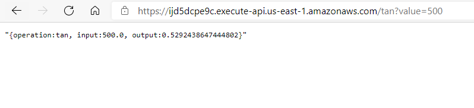

# Parcial Segundo Tercio
### Pre-requisitos
Para hacer uso del software es necesario tener instalado:
* Java: Como lenguaje de programación                                      
    Siga las instrucciones en https://docs.oracle.com/en/java/javase/15/install/
* Maven: Automatiza y estandariza el flujo de vida de la construcción de software.                 
    Siga las instrucciones en http://maven.apache.org/download.cgi#Installation
* Git: Administrador descentralizado de configuraciones.                     
    Siga las instrucciones en http://git-scm.com/book/en/v2/Getting-Started-Installing-Git

### Índice
* [Introducción](#introducción) 
* [Imagenes del funcionamiento](#imagenes-del-funcionamiento)
* [Despliegue de la aplicación](#despliegue-de-la-aplicación)

### Introducción 
Diseñar, construir y despliegar el servicio **tan** en una función lambda desplegado en API Gateway. Las función reciben un solo parámetro de tipo "Double", con el nombre de value, y retorna
un JSON que contiene el resultado de la operación.                                 
[Link a la segunda parte del parcial](https://github.com/germanAOQ/AREP-Parcial2-Lambda)
### Imagenes del funcionamiento 




### Despliegue de la aplicación
1. Cree una función lambda con el servicio Lambda de AWS
2. Clone el actual repositorio:
```
git clone https://github.com/germanAOQ/AREP-Parcial2-EC2
```
3. Compile el proyecto desde la raiz de este:
```
mvn clean install
```
4. Modifique el controlador:

5. Cargue el **.jar** alojado en la carpeta target;

6. Cree un API Gateway con el protocolo REST
7. Cree un método GET
8. En la solicitud del método agregue un nuevo parámetro de cadena de consulta de URL

9. Configure la solicitud de integración de la siguiente manera:

10. Implementa la API con una **nueva etapa** y **tan** como nombre de la fase
11. Una vez deplegado, ingrese al link que le proporciona el servicio


